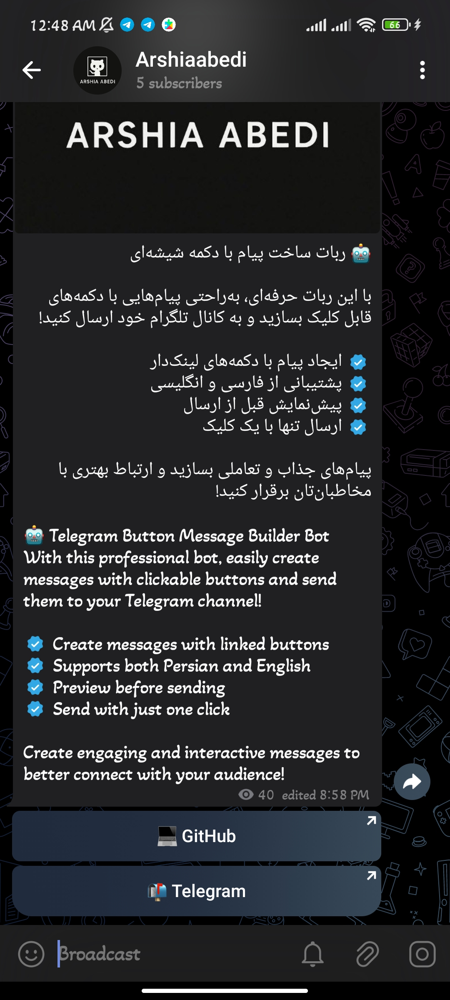

[English](#) | [فارسی](README-fa.md)  <!-- Link to other version -->

# Telegram Bot: Message with Inline Button


## Preview

<p align="center">
  
</p>

<!-- فارسی محتوا --># Telegram Post Bot


A professional bot for managing Telegram channel posts...

</div>
# 📝 Telegram Post Bot - Complete Guide

## 🏷 Project Title
**Professional Telegram Channel Post Bot**

## 🌟 Key Features
- Create text and image posts
- Add stylish buttons with links
- Multi-language support (Persian/English)
- Preview before sending
- Restricted channel posting access

## 🛠 Technologies Used
- Python 3.10+
- pyTelegramBotAPI
- JSON for language management

## 📦 Installation Guide

### Prerequisites
```bash
git clone https://github.com/Arshiag556/ButtonPost.git
cd ButtonPost
python -m venv venv
source venv/bin/activate  # Linux/macOS
venv\Scripts\activate  # Windows
pip install -r requirements.txt
```

### Configuration
1. Complete the following information in `main.py`: 

```python
TOKEN = 'YOUR_BOT_TOKEN'  # Get from @BotFather
CHANNEL_ID = '@YOUR_CHANNEL'  # Target channel
ADMIN_ID = 123456789  # Your numeric ID
```

2. Configure `lang.json` with your translations

### Running the Bot
```bash
python main.py
```

## 🎯 Example Usage
```python
# Sample code for developers
from telebot import TeleBot

bot = TeleBot(TOKEN)

@bot.message_handler(commands=['start'])
def start(message):
    bot.reply_to(message, "Welcome!")
```

## 🤝 Contributing
1. Fork the repository
2. Create new branch (`git checkout -b feature/AmazingFeature`)
3. Commit changes (`git commit -m 'Add some AmazingFeature'`)
4. Push to branch (`git push origin feature/AmazingFeature`)
5. Open Pull Request

## 📜 License
This project is licensed under the **MIT License** - see [LICENSE](LICENSE) file for details.
## 💰 Donations / Support

Support this project's development with cryptocurrency:

**Cryptocurrency:**
- BTC: `bc1qfe63rl66wplznzwzlys95gnetjrg8lx4gcysw7`
- ETH: `0xde0D7CD3bAeA6a64D4e28cF10B1ECB03C6a231EA` 
- USDT (BEP20): `0xde0D7CD3bAeA6a64D4e28cF10B1ECB03C6a231EA`
- TRX (TRC20): `TKj9AGcMK8Qz8utcWQ5ZhnyA9tcLxLBTxW`
- LTC: `ltc1q0ycmvh0qd5fsaj89hhqp842yvxgtygk4n5zvsz`

Thank you for supporting open-source development!

---
## ✉️ Contact Developer
- Email: arshiag556@gmail.com
- Telegram: [@ArshY0X](https://t.me/ArshY0X)

---

🛠 Developed with ❤️ by [Arshia Abedi](https://github.com/Arshiag556), [Ilia Abedi](https://github.com/iliag556)

